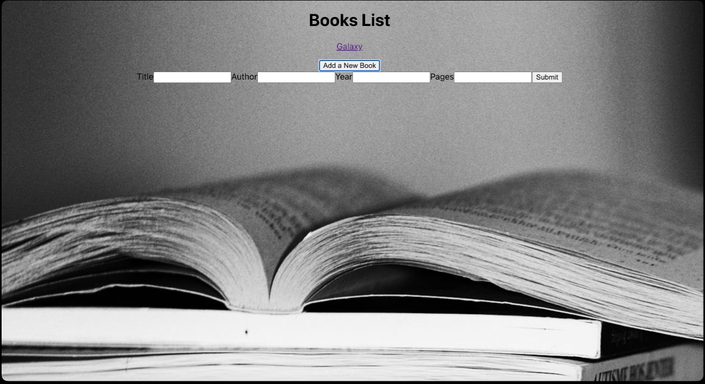

# Books & Reviews

## Explanation

### This project exposes REST api for books and reviews CRUD operations.

#### Books can be created and read

#### Reviews can be created, deleted, edited and read
## Frontend is available at:
- https://github.com/Asmasa1588/phase-3-sinatra-react-project-client
## Requirements

- `ruby` v2.6.1
- `sqlite3` v3.31.1
- `sinatra` v2.1
- `sinatra active record` v 2.0
- `thin` v1.8

## Installation

1. cd into the project and run:
   - `$ bundle install`
2. To create migrations run:
   - `$ rake db:migrate`
3. To seed the database run:
   - `$ rake db:seed`
4. The server will run on http://localhost:9292/. To start the server run:
   - `$ rake server`

## Overview 

For my Phase-3 Ruby project, I have created an app where we can review books. We can also add, edit, or delete a review. We can also create and read and books description.


To begin it we need to do the steps described below.

Lets create a controller folder and in it create a new file- `application_controller.rb`

```Ruby
class ApplicationController < Sinatra::Base
  set :default_content_type, 'application/json'
  
  # Add your routes here
  get "/" do
    { message: "Good luck with your project!" }.to_json
  end

end
```

Once we create our first file lets also create these two
`books_controller.rb`
```Ruby
class BooksController < ApplicationController
    get '/books' do
        Book.all.to_json
    end

    get '/books/:id' do
        book = Book.find(params[:id])
        bookDTO = BookDTO.new
        bookDTO.title = book.title
        bookDTO.author = book.author 
        bookDTO.year = book.year
        bookDTO.pages = book.pages
        reviews = Review.where(book_id: params[:id])
        bookDTO.reviews = reviews
        bookDTO.to_json
    end

    post '/books' do
        #binding.pry
        book = Book.create(
        title: params[:title],
        author: params[:author],
        year: params[:year],
        pages: params[:pages]
        )
        book.to_json
    end
end
```

And `reviews_controller.rb`
```Ruby
class ReviewsController < ApplicationController
    get '/reviews' do
        Review.all.to_json
    end

    get '/reviews/:id' do
        review = Review.find(params[:id])
        review.to_json
    end

    post '/reviews/:bookId' do
        #binding.pry
        review = Review.create(
        review: params[:review],
        book_id: params[:bookId]
        )
        review.to_json
    end

    patch '/reviews/:id' do
        review = Review.find(params[:id])      
        review.update(
            review: params[:review]
            )
        review.to_json
    end

    delete '/reviews/:id' do
        review = Review.find(params[:id])
        review.destroy
        review.to_json
    end
end
```
You will notice that each new controller is extending the application controller `class BooksController < ApplicationController`

And the application controller is extending the Sinatra controller `class ApplicationController < Sinatra::Base`
As you can see books_controller.rb is using a DTO (Data Transfer Object) this is needed because we have a route which is going to return books entity with additional information. You can create that DTO file by creating a DTO folder and creating the following file in it.  
`books_dto.rb`
```Ruby
class BookDTO 
    def title=(titleArg)
        @title = titleArg
    end
    def title
        @title
    end

    def author=(authorArg)
        @author = authorArg
    end
    def author
        @author
    end

    def year=(yearArg)
        @year = yearArg
    end
    def year
        @year
    end

    def pages=(pagesArg)
        @pages = pagesArg
    end
    def pages
        @pages
    end

    def reviews=(reviewsArg)
        @reviews = reviewsArg
    end
    def reviews
        @reviews
    end
end
```


DTO files are perfect when we want to send objects which are different than our models. Speaking of which let’s create a models folder and in it we are going to create files.

Reviews controller contains all of the four CRUD operations. They are consistence of create, read, update, and delete. ‘reviews/‘ GET and ‘reviews/:id' GET are examples of end points for HTTP GET methods. The first end point we return all existing reviews. Where is the second one we will return only the single review that has the provided ID. ‘reviews/:id’  DELETE is an example of a HTTP DELETE method. Its purpose is to delete a particular review based on the provided id.  This end point will return a json object of the deleted review as a response.
‘reviews/:id’ PATCH is an example of a HTTP method for updating the review. This HTTP request will send data via  HTTP request body. That data will be sent through the request via json. We know which review to update because of the provided ID. 
‘reviews’ POST is an example of a HTTP POST request that aims to create a bright new review required data is sent through HTTP request body again in the form of json (JavaScript Object Notation).

 `Book.rb`
```Ruby
class Book < ActiveRecord::Base
    has_many :reviews
end
```
And
`Review.rb`
```Ruby
class Review < ActiveRecord::Base
    belongs_to :book
    validates :review, presence: true

end
```
Models are such files that contains classes which resemble data entity. In this case Books, and Reviews. Notice that we have established the book class that it have many reviews. That’s making one too many relationships with reviews models. We have also specify to where reviews models belongs to. And last but not least, we have specify that the review model has a required property - review

Let’s create our first Migration.
```Ruby
class CreateBooks < ActiveRecord::Migration[6.1]
  def change
    create_table :books do |t|
      t.string :title
    end
  end
end
```
It’s job to create a table books which has one property title. Then we will create a second migration.
```Ruby
class CreateReviews < ActiveRecord::Migration[6.1]
  def change
    create_table :reviews do |t|
      t.text :review
    end
  end
end
```
This migration is responsible for creating a review table that has one column review of type text. 

```Ruby
class AddBookIdToReviews < ActiveRecord::Migration[6.1]
  def change
    add_column :reviews, :book_id, :integer
  end
end
```
The AddBookIdToReviews migration as its name suggests aims to add a new column to the reviews table. Thus , implementing a many to one relationship with he books table via the book_id column.
```Ruby
class AddAuthorToBooks < ActiveRecord::Migration[6.1]
  def change
    add_column :books, :author, :string
    add_column :books, :year, :integer
    add_column :books, :pages, :integer
  end
end
```
This migration will add three new columns to the books table. The first column will be an author of type text.
Interestingly enough a book has other interesting information such as year of published and number of pages. And that why we have two more columns ,year and pages.
Now you can run the migration by using the following command:
    * $ rake db:migrate
The above command will execute all of the four mentioned migrations. When it is done, it will generate a schema.rb file containing this:
```Ruby
ActiveRecord::Schema.define(version: 2022_12_15_193213) do

  create_table "books", force: :cascade do |t|
    t.string "title"
    t.string "author"
    t.integer "year"
    t.integer "pages"
  end

  create_table "reviews", force: :cascade do |t|
    t.text "review"
    t.integer "book_id"
  end

end
```
And this dear readers is the final version of the database. This file auto generated and because of that you should never edit it. Instead what you can do is to create a new migration that changes the database( in case you need to edit it).
Our final file is the seeds.rb file
puts "🌱 Seeding spices..."

book = Book.create(title: "Galaxy", author: "Steve jobs", year: 2004, pages: 114)
review = Review.create(review: "Review on Galaxy", book_id: 2)

puts "✅ Done seeding!"

Its purpose is to populate the database with some initial data. You can start the seeds.rb script by executing the following.
    * $ rake db:seed
Congratulations you have created a simple CRUD application and you can start it by executing by this command:
    * $ rake server

The server will run on http://localhost:9292/. 

