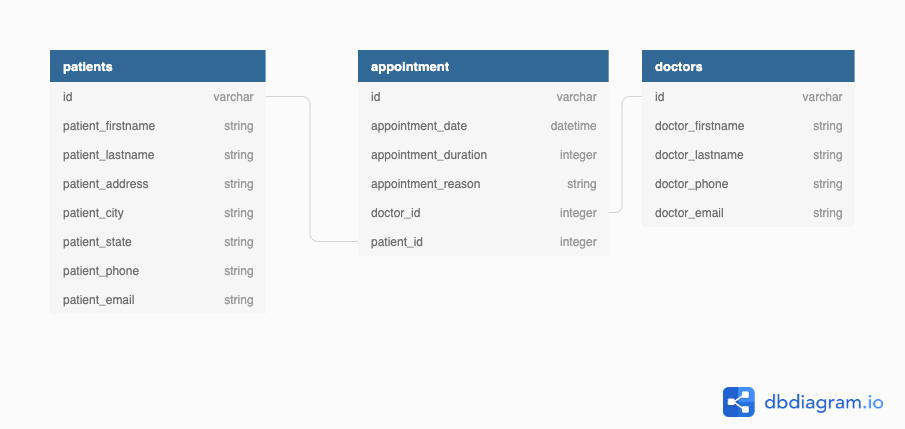

# Phase 3 Project Guidelines



## Endpoints

- `GET /`: TODO

- `GET /appointments`: Get appointments

  - `POST /appointments`: Create appointments
  - `PATCH /appointments/:id`: Update appointment by id (Change only to date and duration?)
    - Updating: date, duration, reason, and type
  - `DELETE /appointments/:id`: Delete appointment
  - `GET /appointments/:id`: Get appointment by id

- `GET /doctors`: Get doctors
- `GET /patients`: Get patients

## TODO:

- [x] Make Seeds
- [ ] Write some methods in the Models (patient.rb, appointment.rb, and doctor.rb)
- [ ] Write routes in the Controller (application_controller.rb)

- [ ] `GET /appointments/<YYYY-MM-DD date string>`: Get appointments for a day

- [ ] Have seperate pages for list of all patients and doctors

  - [ ] `POST /doctors/`: Create new doctor
  - [ ] `POST /doctors/names`: Get all doctor's first and last names
  - [ ] `GET /doctors/:doctor_id`:
  - [ ] `PATCH /doctors/:doctor_id`:
  - [ ] `DELETE /doctors/:doctor_id`:
  - [ ] `GET /doctors/:doctor_id/appointments`:

  - [ ] `POST /patients/`: Create new patient
  - [ ] `POST /patients/names`: Get all patient's first and last names
  - [ ] `GET /patients/:patient_id`:
  - [ ] `PATCH /patients/:patient_id`:
  - [ ] `DELETE /patients/:patient_id`:
  - [ ] `GET /patients/:patient_id/appointments`:

- [ ] Add more columns:
  - [ ] photo (doctor, patient)
  - [ ] Zoom url (appointment)
  - [ ] race (patient)
  - [ ] gender (patient)
  - [ ] available hours (in minutes integer) (doctor)
  - [ ] specialty (doctor)
  - [ ] insurance (patient)
  - [ ] status (appointment)
  - [ ] office (appointment)

## Directory:

```
.
├── CONTRIBUTING.md
├── Gemfile
├── Gemfile.lock
├── LICENSE.md
├── README.md
├── Rakefile
├── app
│   ├── controllers
│   │   └── application_controller.rb
│   └── models
│       ├── appointment.rb
│       ├── doctor.rb
│       └── patient.rb
├── config
│   ├── database.yml
│   └── environment.rb
├── config.ru
├── db
│   ├── development.sqlite3
│   ├── migrate
│   │   ├── 20220415214412_create_doctors.rb
│   │   ├── 20220415214417_create_patients.rb
│   │   └── 20220415214424_create_appointments.rb
│   ├── schema.rb
│   └── seeds.rb
├── diagram.png
└── spec
    └── spec_helper.rb

7 directories, 21 files
```

## Getting Started

### Backend Setup

You can start your server with:

```console
$ bundle exec rake server
```

This will run your server on port
[http://localhost:9292](http://localhost:9292).

### Fetch Example

Your React app should make fetch requests to your Sinatra backend! Here's an
example:

```js
fetch("http://localhost:9292/test")
  .then((r) => r.json())
  .then((data) => console.log(data));
```
