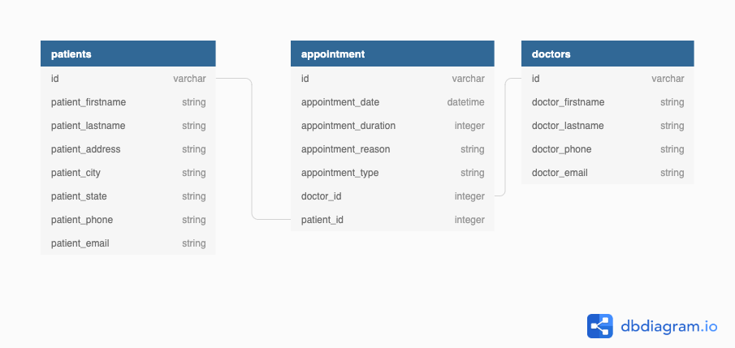

# Phase 3 Project Guidelines




## TODO:
- [ ] Make Seeds
- [ ] Write methods in the Models (patient.rb, appointment.rb, and doctor.rb)
- [ ] Write routes in the Controller (application_controller.rb)
- [ ] Task 4
- [ ] Task 5


## Directory:
```
.
├── CONTRIBUTING.md
├── Gemfile
├── Gemfile.lock
├── LICENSE.md
├── README.md
├── Rakefile
├── app
│   ├── controllers
│   │   └── application_controller.rb
│   └── models
│       ├── appointment.rb
│       ├── doctor.rb
│       └── patient.rb
├── config
│   ├── database.yml
│   └── environment.rb
├── config.ru
├── db
│   ├── development.sqlite3
│   ├── migrate
│   │   ├── 20220415214412_create_doctors.rb
│   │   ├── 20220415214417_create_patients.rb
│   │   └── 20220415214424_create_appointments.rb
│   ├── schema.rb
│   └── seeds.rb
├── diagram.png
└── spec
    └── spec_helper.rb
```

## Getting Started

### Backend Setup

This repository has all the starter code needed to get a Sinatra backend up and
running. [**Fork and clone**][fork link] this repository to get started. Then, run
`bundle install` to install the gems.

[fork link]: https://github.com/learn-co-curriculum/phase-3-sinatra-react-project/fork

The `app/controllers/application_controller.rb` file has an example GET route
handler. Replace this route with routes for your project.

You can start your server with:

```console
$ bundle exec rake server
```

This will run your server on port
[http://localhost:9292](http://localhost:9292).

### Frontend Setup

Your backend and your frontend should be in **two different repositories**.

Create a new repository in a **separate folder** with a React app for your
frontend. `cd` out of the backend project directory, and use
[create-react-app][] to generate the necessary code for your React frontend:

```console
$ npx create-react-app my-app-frontend
```

After creating the project locally, you should also
[create a repository on GitHub][create repo] to host your repo and help
collaborate, if you're working with a partner.

### Fetch Example

Your React app should make fetch requests to your Sinatra backend! Here's an
example:

```js
fetch("http://localhost:9292/test")
  .then((r) => r.json())
  .then((data) => console.log(data));
```


